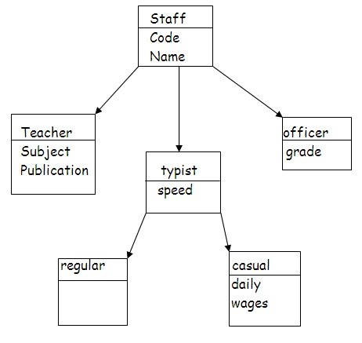

# Warmup_Week02_Day04 🔥
---
## An educational institution wishes to maintain a database of its employees. The database is divided into a number of classes whose hierarchical relationships are shown in following figure. The figure also shows the minimum information required for each class. Specify all classes and define functions to create the database and retrieve individual information as and when required.




# Output
```
About teacher:

name       code               subject                   publication

Ataur      420          programming with kotlin      Tata McGraw Hill
-------------------------------------------------------------------------
About officer:

name                code               Category

Md. Rashed          222               First class
-------------------------------------------------------------------------
About regular typist :

name              code           speed                  wage

Robiul Awal       333            85.5                   15000
-------------------------------------------------------------------------
About causal typist :

name                  code            speed             wage

Kawser Ahmed          333           78.900002          10000
```

